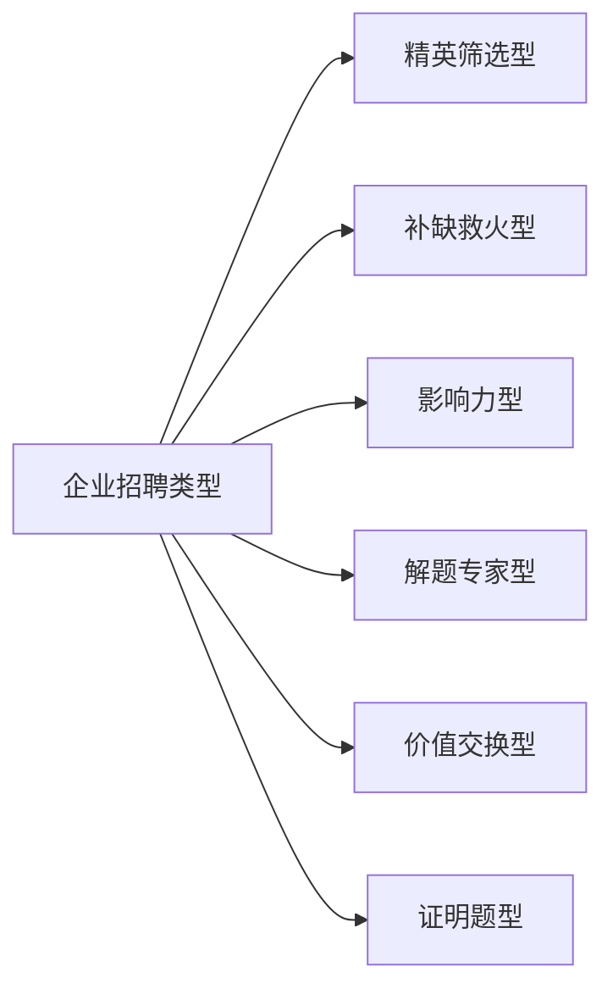
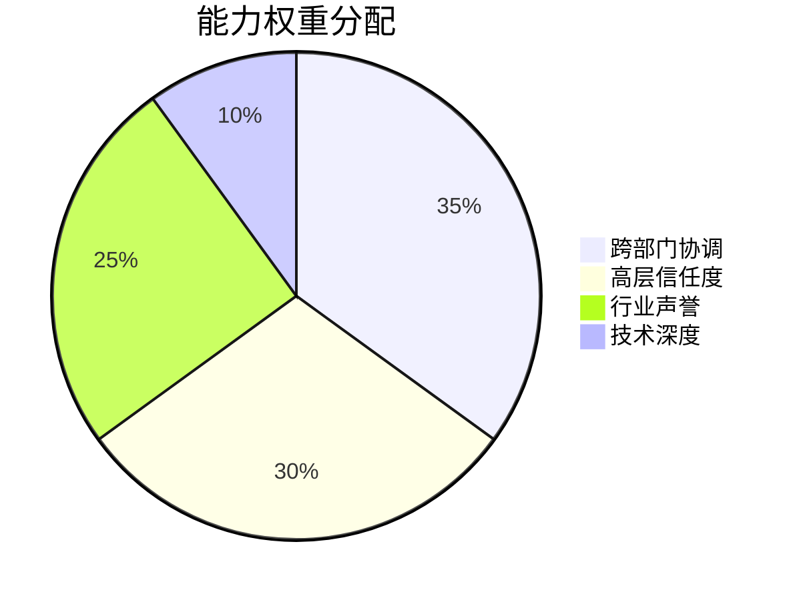
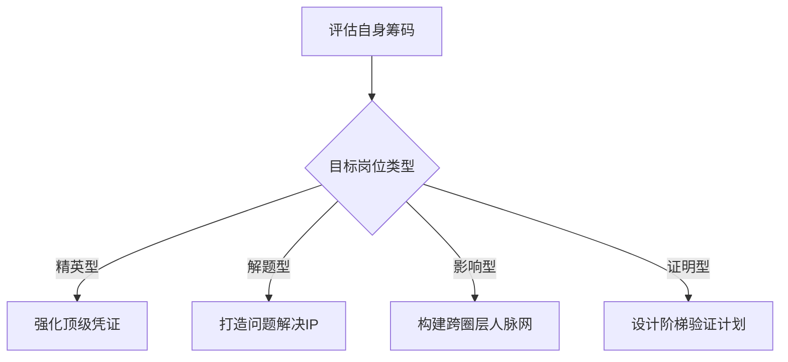

# 解码招聘暗流：六类企业招聘逻辑与候选人的破局之道

> 在看似混乱的求职市场中，隐藏着企业招聘的底层密码。  
> 理解这些密码，将让你从被动投递者蜕变为主动布局者。

## 一、人才市场的“隐性分类学”
当我们谈论“找工作”时，实际上面对的是六种截然不同的招聘逻辑体系。不同企业（甚至同一企业的不同部门）因战略需求差异，演化出完全不同的用人标准。传统“一份简历走天下”的策略正在失效。



## 二、深度解剖六大招聘类型

### 1. 精英筛选型：金字塔尖的残酷游戏
**企业诉求**  
“已有90分团队，需要95分选手改变战局”  
典型场景：头部企业核心部门、战略级项目组  

**候选人画像**  
```diff
+ 清北/常青藤学历 + 3家以上顶尖企业履历  
+ 主导过行业标杆项目（专利/论文/开源项目）  
- 职业经历存在断层或降级者直接出局
```

**破局策略**  
- 打造“可验证的系统性优势”：将项目成果转化为量化指标（如“提升算法效率300%”）  
- 构建认知护城河：在专业社区持续输出深度内容（GitHub技术博客、行业白皮书）  

---

### 2. 补缺救火型：效率至上的生存法则
**企业痛点**  
“项目明天就要上线，人昨天就该到位”  
常见于：快速扩张期企业、人员流失严重部门  

**真实需求**  
```! 关键提示：此类岗位最易出现“面试造火箭，入职拧螺丝”现象```

**谈判筹码**  
- 强调即战力价值：“可无缝接手XX系统”（携带经过脱敏的解决方案文档）  
- 要求快速入职奖金（通常有30%薪资上浮空间）  

---

### 3. 影响力型：组织生态的“关键物种”
**核心价值**  


**典型场景**  
- 面向政府/央企的接口人  
- 创新业务对外发言人  

**致命陷阱**  
> “技术大牛最容易踩的坑：用代码思维处理政治问题”  
> 案例：某AI首席科学家因公开质疑CEO战略被离职  

---

### 4. 解题专家型：人才密集区的生存法则
**特殊挑战**  
“团队全是奥赛金牌，你需要解出别人卡住3个月的难题”  

**能力验证机制**  
```python
# 企业实际采用的筛选逻辑
def hire_expert(candidate):
    if candidate.solved_hard_problem < INDUSTRY_TOP3: 
        return "Reject"
    if candidate.domain_knowledge < TEAM_AVERAGE:
        return "Reject"
    return "Offer with 50% premium"
```

**生存指南**  
- 建立问题库：持续追踪该领域三年未解难题  
- 打造“解题工具箱”：将方法论产品化（如自动驾驶领域的仿真测试框架）  

---

### 5. 价值交换型：非对称博弈的艺术
**典型场景**  
- 硅谷大牛加入中国独角兽  
- 互联网高管转型传统产业  

**交易本质**  
| 付出代价       | 预期收益         |
|----------------|------------------|
| 薪资降幅30-50% | 股权增值5-10X   |
| 头衔降级       | 决策权倍增      |
| 离开舒适区     | 赛道先发优势    |

**风控要点**  
- 验证企业真实估值（要求查阅近期审计报告）  
- 设置对赌条款（如用户增长达标自动恢复原薪）  

---

### 6. 证明题型：跨圈层晋升的修罗场
**残酷现实**  
> 当你要从互联网跳槽新能源：  
> 原有成就权重仅占30%，70%看跨界能力证明  

**三维证明体系**  
```diff
+ 认知证明：输出该领域深度分析报告（被行业媒体转载）
+ 人脉证明：获得2位目标圈内KOL推荐
+ 最小化验证：6个月内完成可量化的试点项目
```

## 三、候选人的战略地图



## 终极警示：能力与影响力的平衡术
**技术型人才的死亡循环**  
```
技术跃迁 → 忽视影响力建设 → 关键决策失语 → 项目失败担责  
```
解药方案：每提升1级技术能力，同步建设0.8级管理影响力（通过内部创新孵化、行业标准参与等）

> 在这个分层博弈的市场，  
> 最危险的并非能力不足，  
> 而是用解题专家的姿态去应聘门面担当，  
> 或以补位者的心态冲击精英战场。  
> 看清游戏规则，方能落子无悔。

